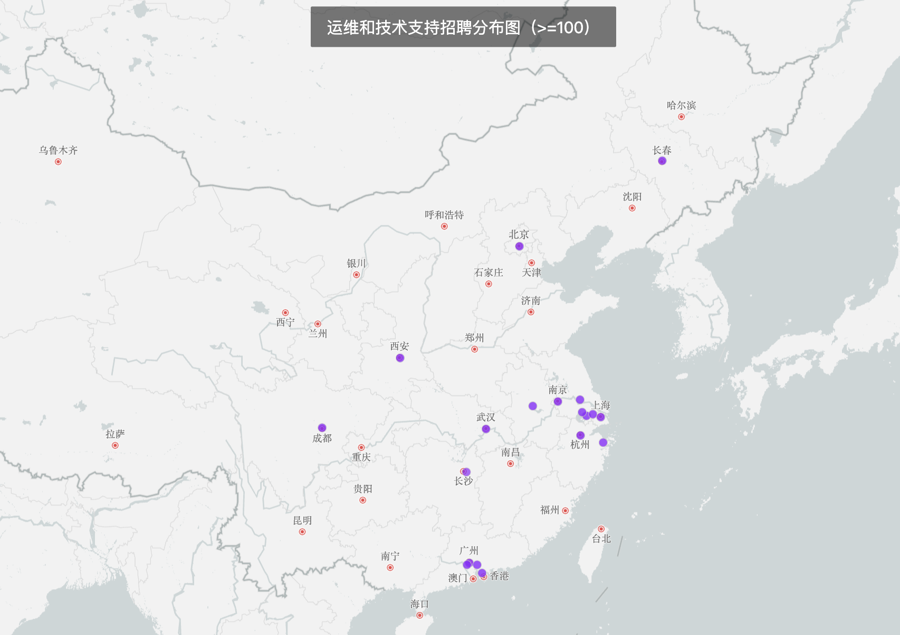
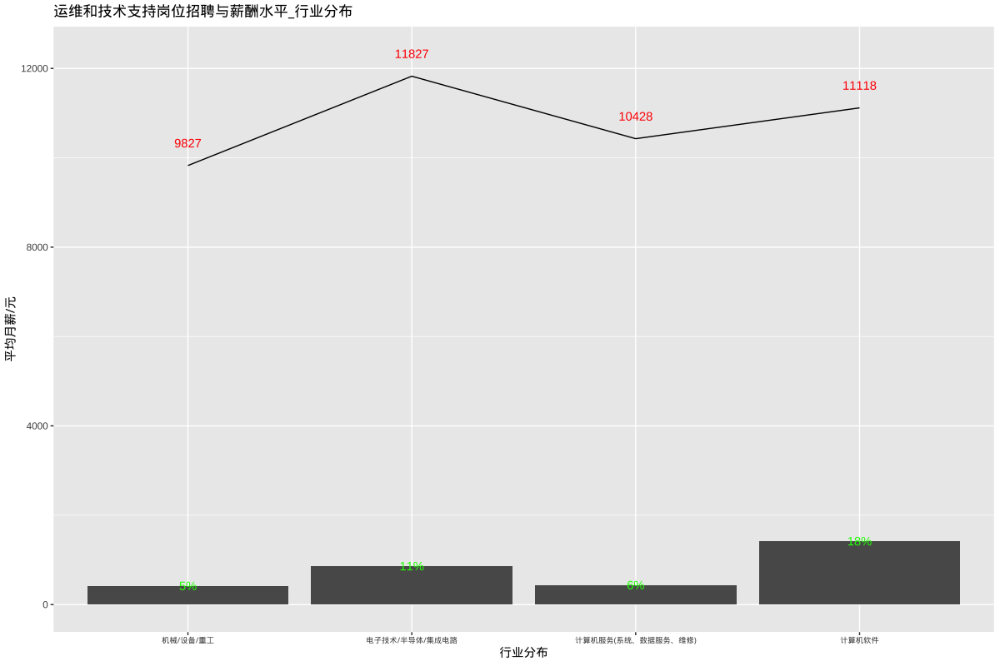
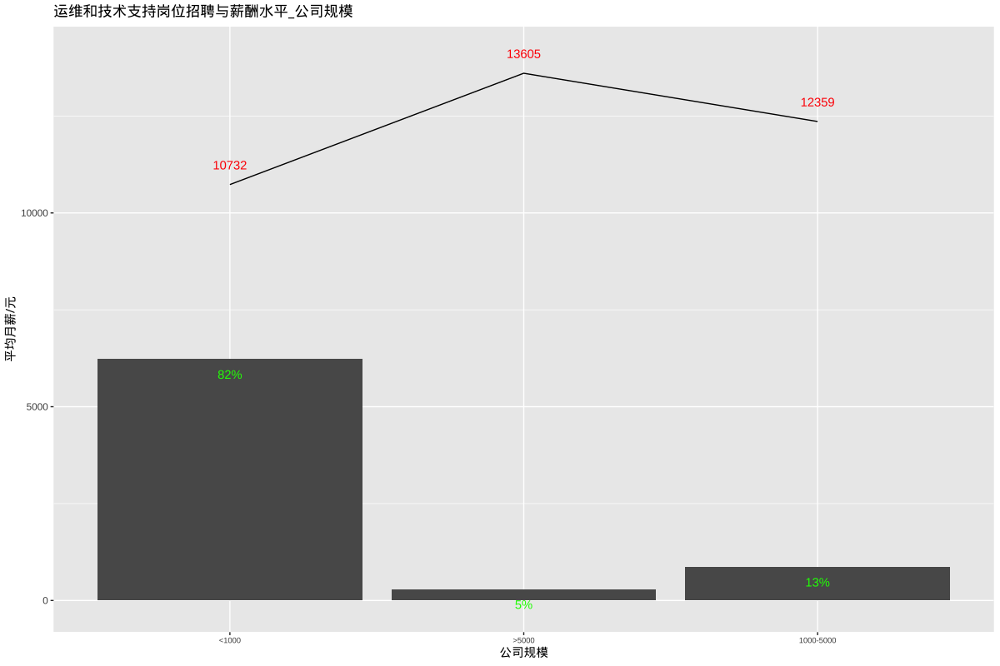
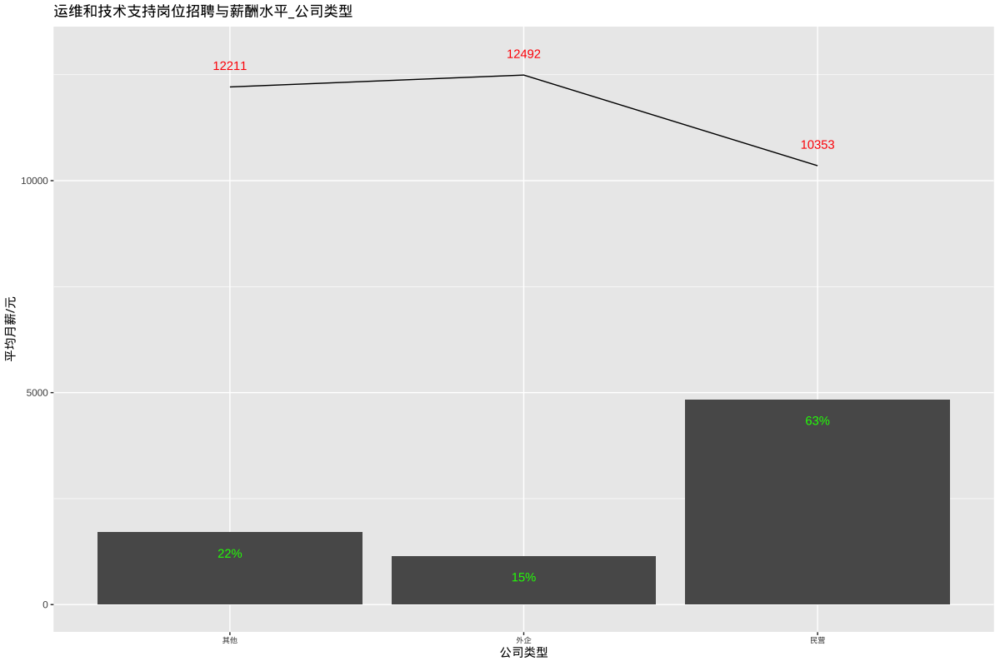
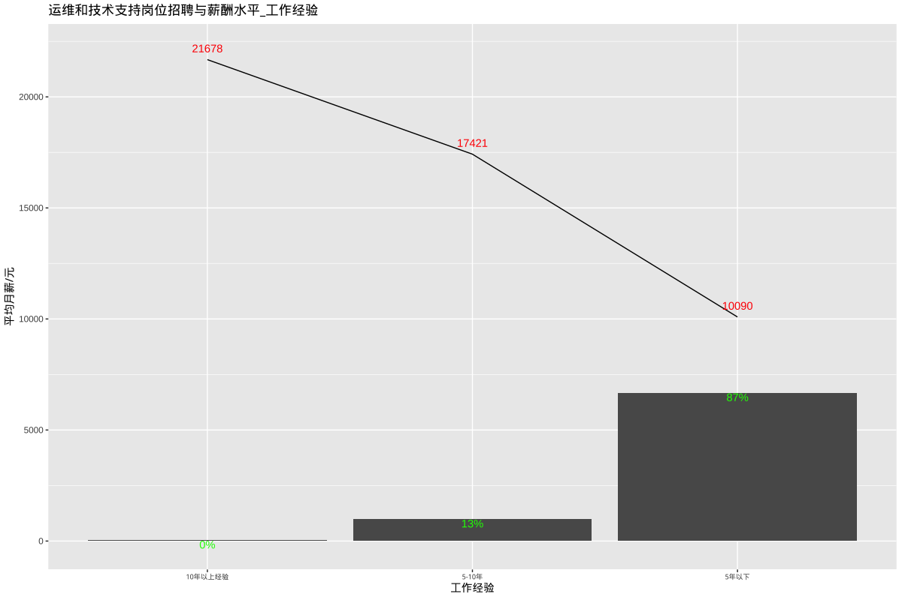
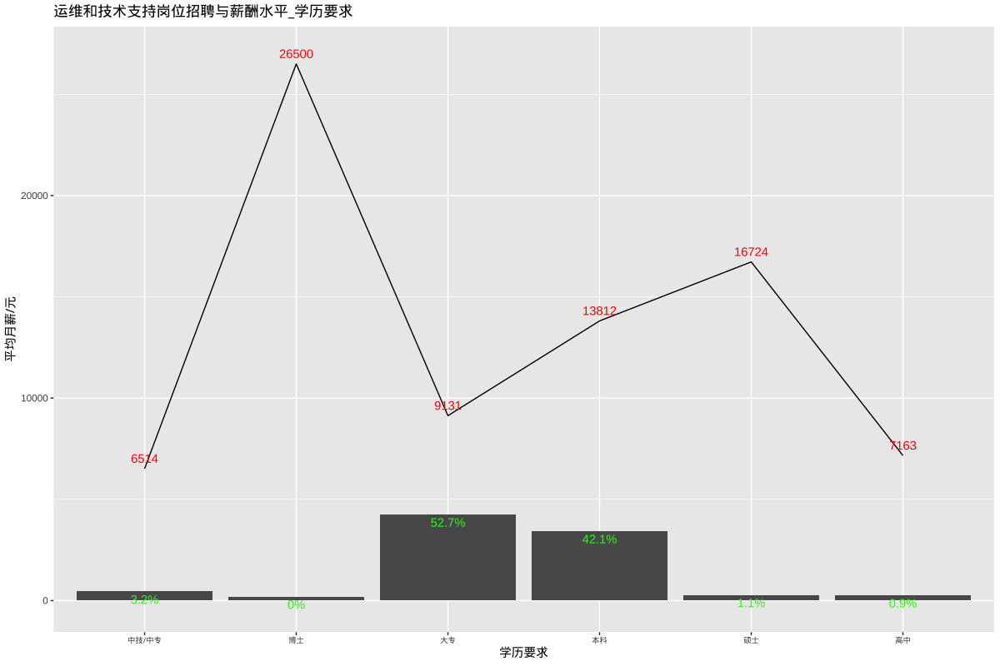

# 运维与技术支持岗位招聘和薪酬

## 总述

本次采集有效数据7694条(城市发布量\>=100),主要分析运营维护和技术支持相关岗位招聘和薪酬，岗位如：运维工程师、技术支持工程师、网络工程师、软件实施工程师、IT工程师、系统集成工程师等。我们将从如下方面分析：

-   01.城市分布：招聘需求主要集中在上海、深圳、广州，分别占市场需求的23%、14%、11%，平均月薪分别为13430元、12295元、10127元；其余城市均在6%及以下。

-   02.行业分布：计算机软件占18%，平均月薪11118元；电子技术/半导体/集成电路占11%，平均月薪11827元。

-   03.公司规模：\<1000人企业占82%，平均月薪10732元；1000-5000人占13%，平均月薪12359元。

-   04.公司类型：民企占63%，平均月薪10353元；外企占15%，平均月薪12492元。

-   05.工作经验：5年以下占87%，平均月薪10090元；5-10年占13%，平均月薪17421元。

-   06.学历要求：本科占42%，平均月薪13812元；大专占53%，平均月薪9131元。

## 01.城市分布

## 02.行业分布

## 03.公司规模

## 04.公司类型

## 05.工作经验

## 06.学历要求

